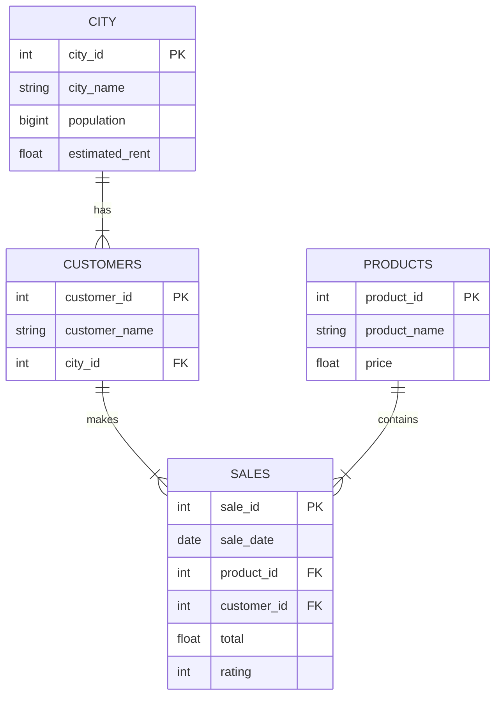

# ☕ Coffee Shop Sales Analysis


## 📌 Project Overview
This project involves analyzing sales data for a coffee shop chain to understand customer behavior, product performance, and city-level trends. By utilizing advanced SQL techniques, this analysis helps identify high-potential markets and optimize sales strategies.


## 🛠️ Tech Stack
- **Database:** MySQL 8.0
- **GUI:** MySQL Worbench
- **Concepts Used:** - Aggregations (`SUM`, `COUNT`, `ROUND`)
  - Joins (`INNER JOIN`, `LEFT JOIN`)
  - Window Functions (`OVER`, `RANK`, `DENSE_RANK`, `LAG`)
  - CTEs (Common Table Expressions)

## 📂 Database Schema
The project uses four main tables:
1. **City:** City demographics, population, and estimated rent.
2. **Customers:** Customer details and location linkage.
3. **Products:** Coffee items and pricing.
4. **Sales:** Transactional data including dates, totals, and ratings.

### Entity Relationship Diagram


## 📊 Analysis & Queries

The following business questions were analyzed using SQL queries.

### 1. Coffee Consumers Count
**Question:** How many people in each city are estimated to consume coffee, given that 25% of the population does?

```sql
SELECT 
    city_name,
    ROUND(((population * 0.25) / 1000000), 2) AS coffee_consumers_in_millions
FROM city
ORDER BY 2 DESC;
```

### 2. Total Revenue from Coffee Sales
**Question:** What is the total revenue generated from coffee sales across all cities in the last quarter of 2023?

```sql
SELECT 
    ci.city_name,
    SUM(s.total) AS total_revenue,
    ROUND((SUM(s.total) / SUM(SUM(total)) OVER()) * 100, 2) AS percentage_contribution
FROM city ci
JOIN customers c ON ci.city_id = c.city_id
JOIN sales s ON c.customer_id = s.customer_id
WHERE s.sale_date BETWEEN '2023-10-01' AND '2023-12-31'
GROUP BY ci.city_name
ORDER BY total_revenue DESC;
```

### 3. Sales Count for Each Product
**Question:** How many units of each coffee product have been sold?

```sql
SELECT 
    p.product_name,
    COUNT(DISTINCT s.sale_id) AS total_orders,
    SUM(s.total) AS total_revenue,
    ROUND((SUM(s.total) / SUM(SUM(s.total)) OVER()) * 100, 2) AS percentage_contribution
FROM products p
JOIN sales s ON p.product_id = s.product_id
GROUP BY p.product_name
ORDER BY total_revenue DESC;
```

### 4. Average Sales Amount per City
**Question:** What is the average sales amount per customer in each city?

```sql
SELECT 
    ci.city_name,
    ROUND(SUM(s.total) / COUNT(DISTINCT c.customer_id), 2) AS avg_sale_per_cust
FROM city ci
JOIN customers c ON ci.city_id = c.city_id
JOIN sales s ON c.customer_id = s.customer_id
GROUP BY ci.city_name
ORDER BY avg_sale_per_cust DESC;
```

### 5. City Population and Coffee Consumers
**Question:** Provide a list of cities along with their populations and estimated coffee consumers.

```sql
SELECT 
    city_name,
    ROUND((population / 1000000), 2) AS population_millions,
    ROUND(((population * 0.25) / 1000000), 2) AS est_coffee_consumers_millions
FROM city;
```

### 6. Top Selling Products by City
**Question:** What are the top 3 selling products in each city based on sales volume?

```sql
WITH Ranked_City AS (
    SELECT 
        ci.city_name,
        p.product_name,
        SUM(s.total) AS total_sale,
        DENSE_RANK() OVER(PARTITION BY ci.city_name ORDER BY SUM(s.total) DESC) AS drnk
    FROM city ci
    JOIN customers c ON ci.city_id = c.city_id
    JOIN sales s ON c.customer_id = s.customer_id
    JOIN products p ON s.product_id = p.product_id
    GROUP BY ci.city_name, p.product_name
)
SELECT city_name, product_name, total_sale
FROM Ranked_City
WHERE drnk <= 3;
```

### 7. Customer Segmentation by City
**Question:** How many unique customers are there in each city who have purchased coffee products?

```sql
SELECT 
    ci.city_name,
    COUNT(DISTINCT s.customer_id) AS unique_customers
FROM city ci
LEFT JOIN customers c ON ci.city_id = c.city_id
JOIN sales s ON c.customer_id = s.customer_id
GROUP BY ci.city_name;
```

### 8. Average Sale vs Rent
**Question:** Find each city and their average sale per customer and avg rent per customer.

```sql
SELECT 
    ci.city_name,
    ROUND(SUM(s.total) / COUNT(DISTINCT s.customer_id), 2) AS avg_sale,
    ci.estimated_rent
FROM city ci
JOIN customers c ON ci.city_id = c.city_id
JOIN sales s ON c.customer_id = s.customer_id
GROUP BY ci.city_name, ci.estimated_rent;
```

### 9. Monthly Sales Growth
**Question:** Calculate the percentage growth (or decline) in sales over different time periods (monthly).

```sql
WITH Monthly_Sales AS (
    SELECT 
        DATE_FORMAT(sale_date, "%b %Y") AS Month_Name,
        SUM(total) AS Total_Sale
    FROM sales
    GROUP BY 1
),
Prev_Month_Sales AS (
    SELECT 
        Month_Name,
        Total_Sale,
        LAG(Total_Sale) OVER(ORDER BY STR_TO_DATE(Month_Name, "%b %Y")) AS Prev_Month_Sale
    FROM Monthly_Sales
)
SELECT 
    Month_Name,
    Total_Sale,
    ROUND(((Total_Sale - Prev_Month_Sale) / Prev_Month_Sale) * 100, 2) AS Percentage_Growth
FROM Prev_Month_Sales;
```

### 10. Market Analysis: Top 3 Cities
**Question:** Identify the top 3 cities based on highest sales, returning city name, total sale, total rent, total customers, and estimated coffee consumers.

```sql
WITH City_sales_summary AS (
    SELECT 
        c.city_id,
        SUM(s.total) AS total_sale,
        COUNT(DISTINCT s.customer_id) AS unique_customers
    FROM customers c
    JOIN sales s ON c.customer_id = s.customer_id
    GROUP BY c.city_id
)
SELECT 
    ci.city_name,
    css.total_sale,
    css.unique_customers,
    ci.estimated_rent,
    ROUND(((ci.population * 0.25) / 1000000), 2) AS estimated_coffee_consumer_millions
FROM city ci
JOIN city_sales_summary css ON ci.city_id = css.city_id
ORDER BY css.total_sale DESC
LIMIT 3;
```

## 🚀 How to Use
1. **Database Setup**

  - Ensure you have MySQL installed on your local machine.

  - Execute the schema creation script to set up the tables:

SQL
  ```sql Copy the DROP/CREATE TABLE statements from the source code```
  
2. **Data Import**

  - The data is provided in CSV format.
  - Use the MySQL Import Wizard (in MySQL Workbench) or the LOAD DATA INFILE command to import the datasets into their respective tables:

    - `city.csv` → `city` table
    - `customers.csv` → `customers` table
    - `products.csv` → `products` table
    - `sales.csv` → `sales` table

3. **Run Analysis**

  - Open your preferred SQL client (e.g., MySQL Workbench, DBeaver).
  - Execute the queries listed below to view the analysis results.
